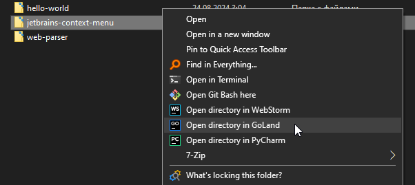
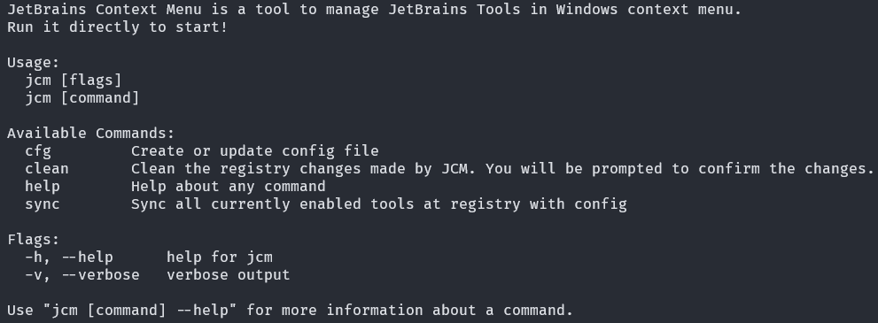
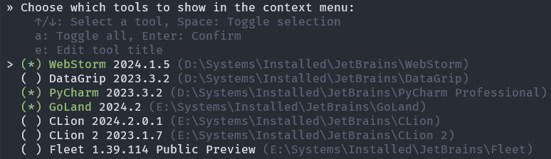
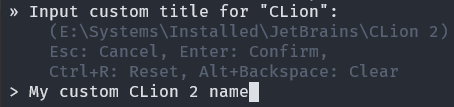

# Jetbrains Context Menu

A simple Windows context menu manager for Jetbrains IDEs.



Made mainly for practicing in the Go programming language, but it came out quite well.

## Installation

You'll need [Go v1.23](https://go.dev/dl) to install JCM and
[JetBrains Toolbox](https://www.jetbrains.com/toolbox-app/)
to get the JCM working properly, as the IDEs are detected by
Toolbox, so they must be installed via it.

```bash
go install github.com/KoJem9Ka/jetbrains-context-menu/cmd/jcm@latest
```

## Guide

All interactions are performed using the `jcm` command line utility.

First of all, you can run `jcm help` to see available commands:



All commands that require interaction with the Windows registry to change
the context menu _**will require administrator privileges**_.
The program will inform you if it does not have them.

### Manage Context Menu

Run executable directly or from command line using `jcm` and you'll be taken to interactive command line interface:



You can edit displayed title right here by pressing 'e' key:



Press Enter to apply changes.

If you entered a custom tool name, the config file will be created after the changes are applied.

### Config File

By default, config file will be created only when it's really needed in the current
directory as `jcm.yaml`.  You can create config file manually
by running `jcm cfg`, or create it at home directory (`%USERPROFILE%\jcm.yaml`)
by `jcm cfg --home`. Config in the current folder has priority over that at
the home folder, if it accidentally appears in both.

To move a config from the current to home directory and vice versa, use the `jcm cfg move` command

After manually changing the config, run `jcm sync` to apply changes, or go
through [Manage Context Menu](#manage-context-menu), it will update custom titles changes.

### Cleanup

You can clean changes from Windows registry made by JCM by running the `jcm clean` command.
To avoid mistakes, the cleanup will not be applied immediately, you will be prompted to
select registry keys to remove, either way, even if you are not careful there should be no problem.
